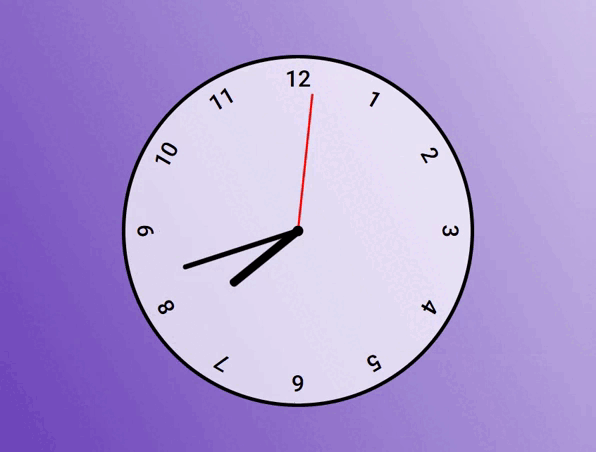

# 🕒 Relógio Analógico

Um projeto simples de um **relógio analógico funcional** que exibe a hora atual em tempo real com ponteiros animados, simulando um mostrador analógico clássico.

## 📷 Preview



## 🚀 Funcionalidades

- Ponteiros funcionais para **horas**, **minutos** e **segundos**
- Atualização automática a cada segundo
- Design com estilo limpo e moderno

## 🛠️ Tecnologias utilizadas

- HTML5
- CSS3
- JavaScript puro (sem bibliotecas)

## 💡 Como usar

Entre no site: [Relógio](https://relogioers.netlify.app/)

OU

1. Clone este repositório:

   ```bash
   git clone https://github.com/Efrals/relogio.git
   ```

2. Navegue até a pasta do projeto

3. Abra o arquivo index.html no navegador.
